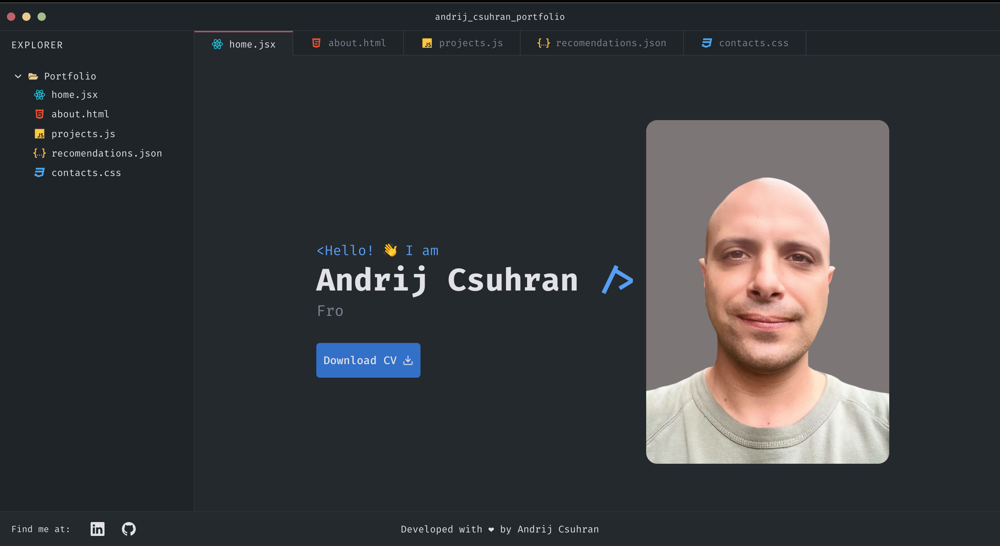

# My Porfolio

<p align="center">
 
</p>

## 💻 Project

Personal portfolio showcasing projects and contact information.

## 🚀 Technologies

This project was developed using the following technologies:

> Front-End: React, Context API, CSS, HTML, JavaScript

## 📌 Skills

In this project, I was able to:

Work with state and components

## 📝 Adjustments and Improvements

The project is still in development, and the upcoming updates will focus on the following tasks:

- [ ] Implement unit testing;

## ⬇️ Installing Dependencies

```bash
cd src/
npm install
```

## 📄 License

This project is licensed. See the LICENSE file for more details.

[⬆️ Back to top](#nome-do-projeto)<br>
